# Bagel · 贝果

[](./LICENSE)
[](https://www.python.org/)
[](https://github.com/astral-sh/uv)

> **Bagel（贝果）**：一个人也能跑起来的 AI 情报中枢 —— 采集 · 审阅 · 汇总 · 飞书触达。

一个 Python 工程 · 一份 `.env` · 可选 Compose · 一个 Web 入口。  
用户只访问 **http://localhost:8000**，无需理解 FreshRSS / RSSHub / PostgreSQL。

**开源协议： [MIT](./LICENSE)** —— 宽松、易二次分发与商用改造，适合作为 GitHub 开源主协议。

---

## 截图

| 登录 | 新闻 | GitHub |
|:---:|:---:|:---:|
| 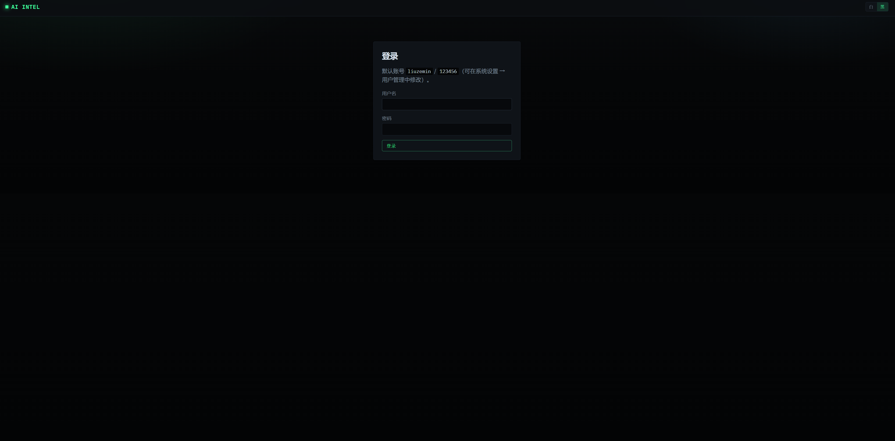 | 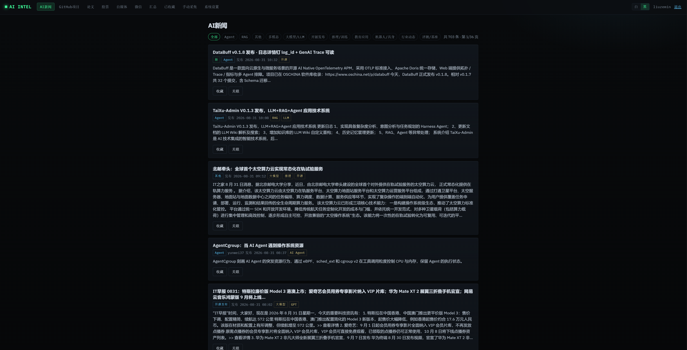 | 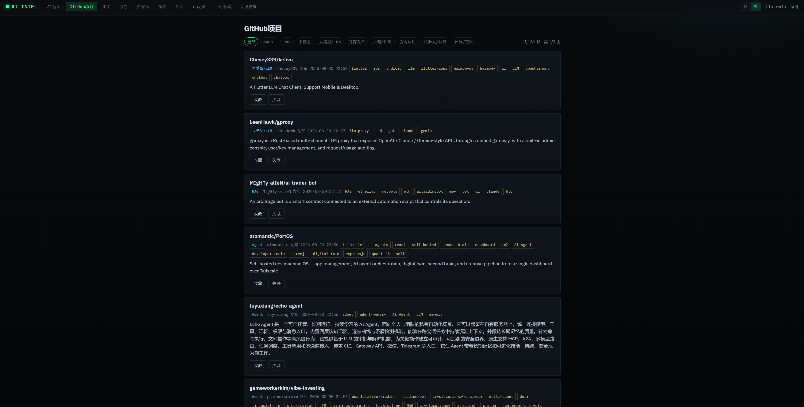 |

| 论文 | 股票 | 自媒体 |
|:---:|:---:|:---:|
| 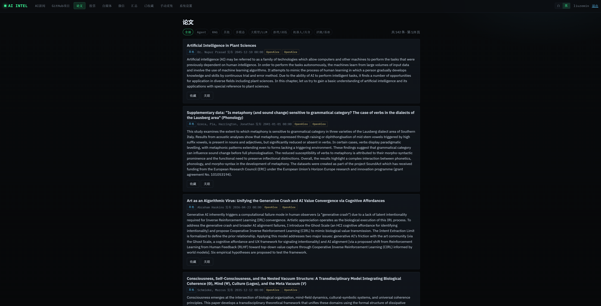 | 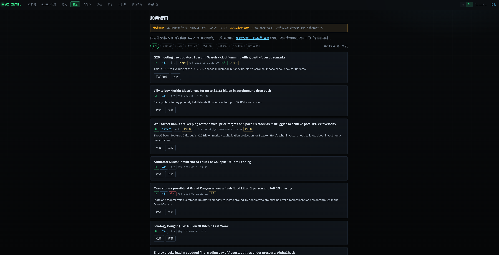 | 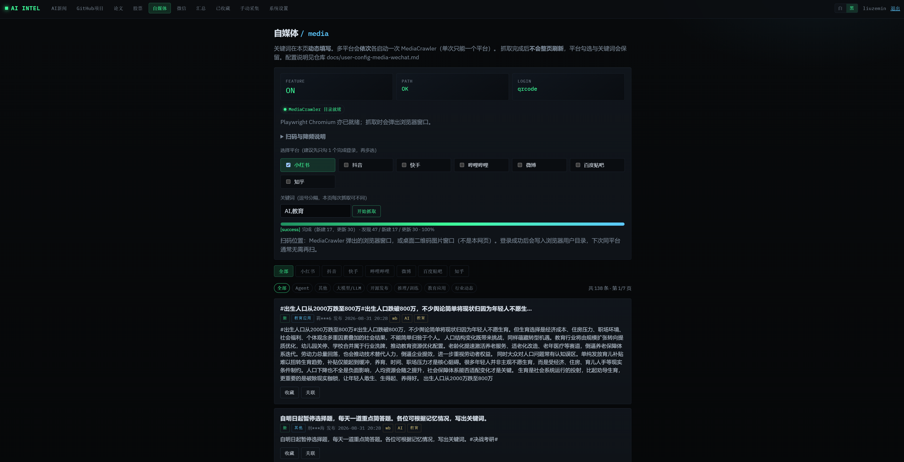 |

| 微信 | 汇总 | 收藏 |
|:---:|:---:|:---:|
| 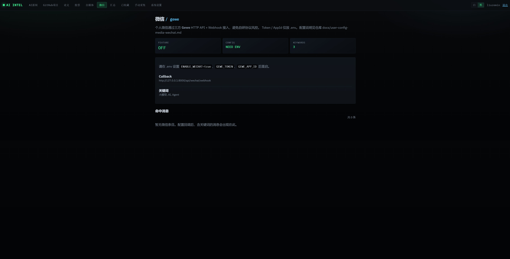 | 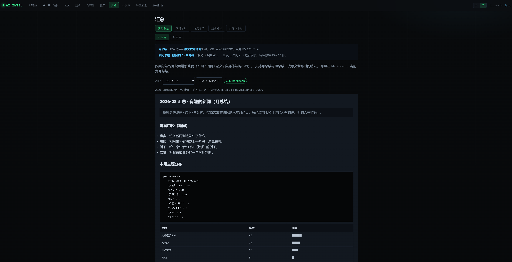 | 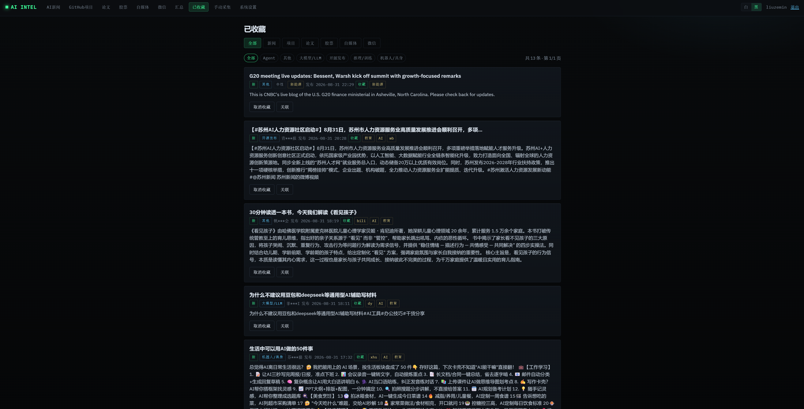 |

| 手动采集 | 过滤标签 | 新闻源 |
|:---:|:---:|:---:|
| 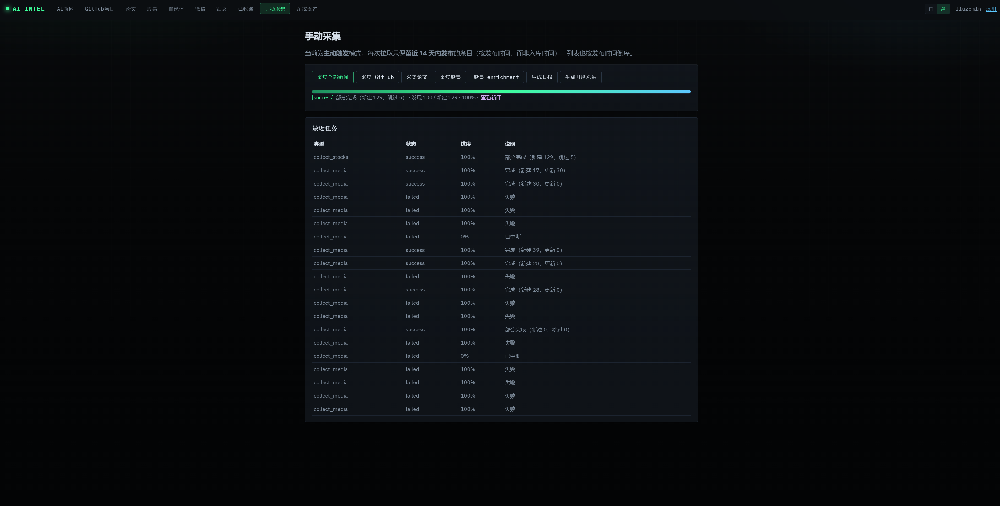 | 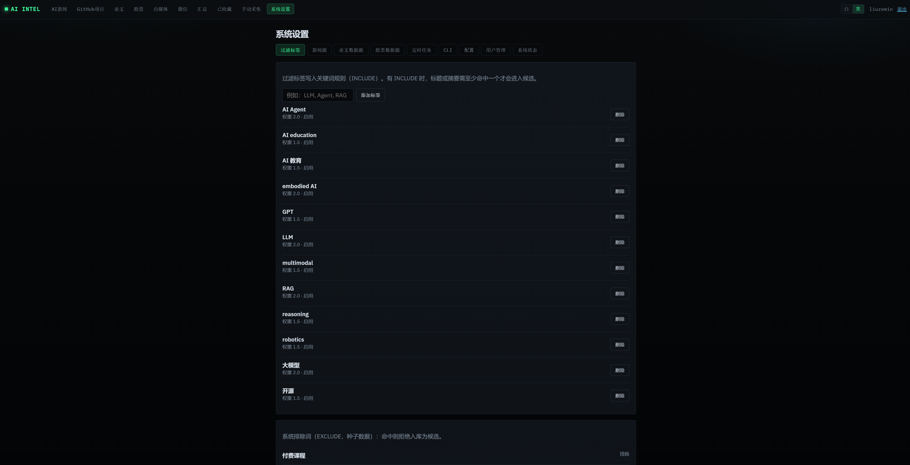 | 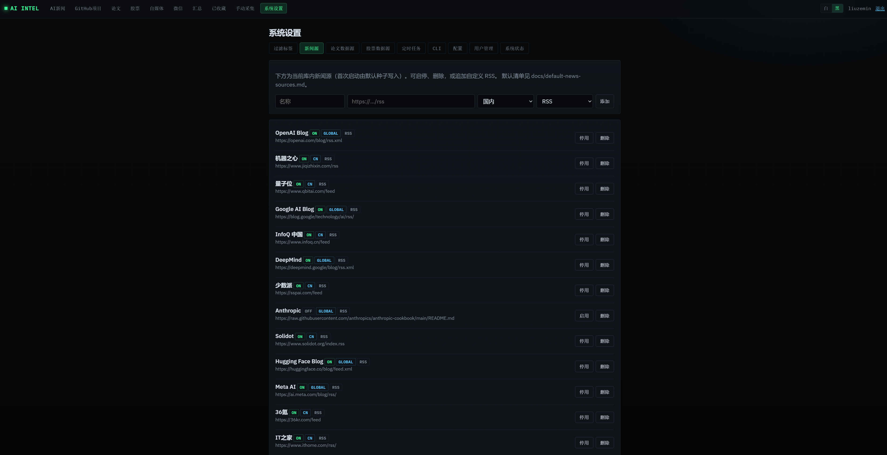 |

| 论文源 | 定时任务 | 股票源 |
|:---:|:---:|:---:|
| 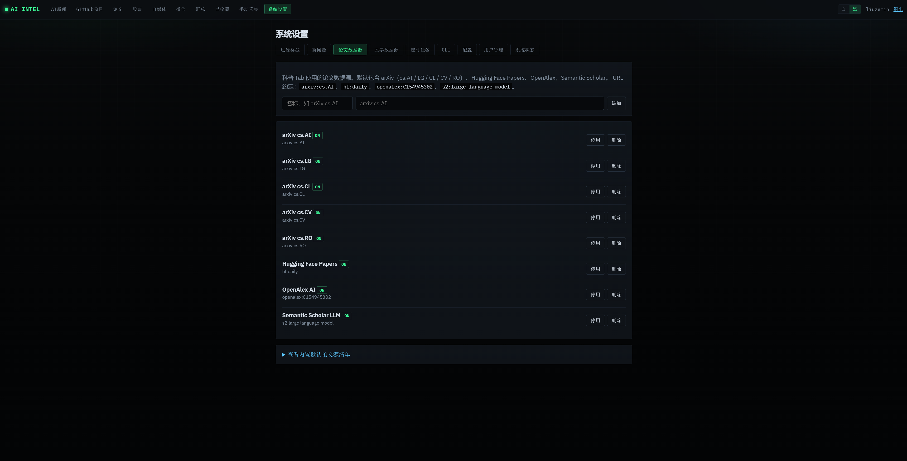 | 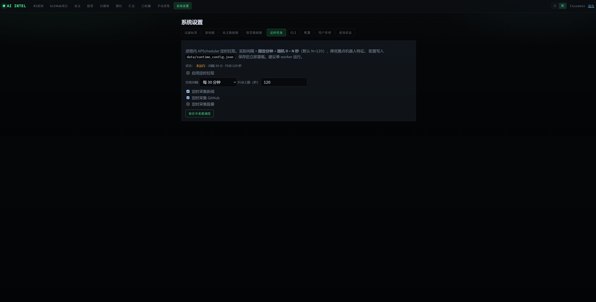 | 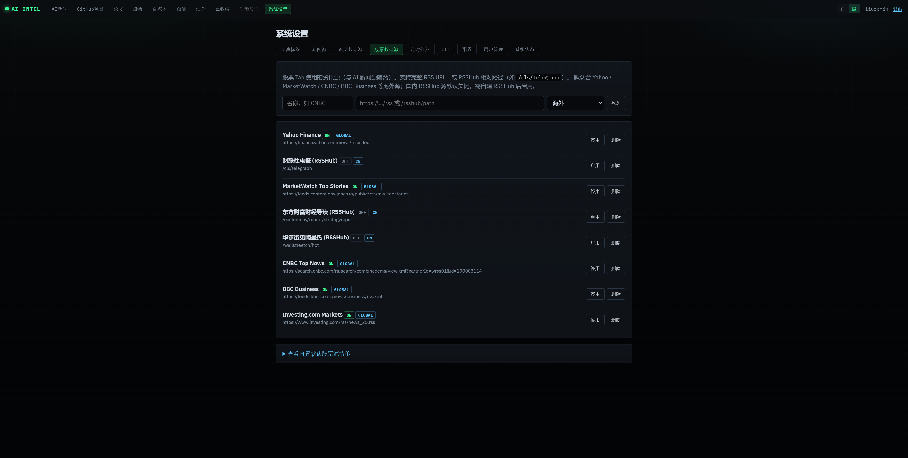 |

| CLI / 飞书 | 配置 | 用户管理 |
|:---:|:---:|:---:|
| 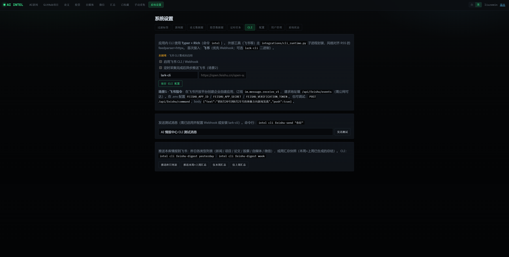 | 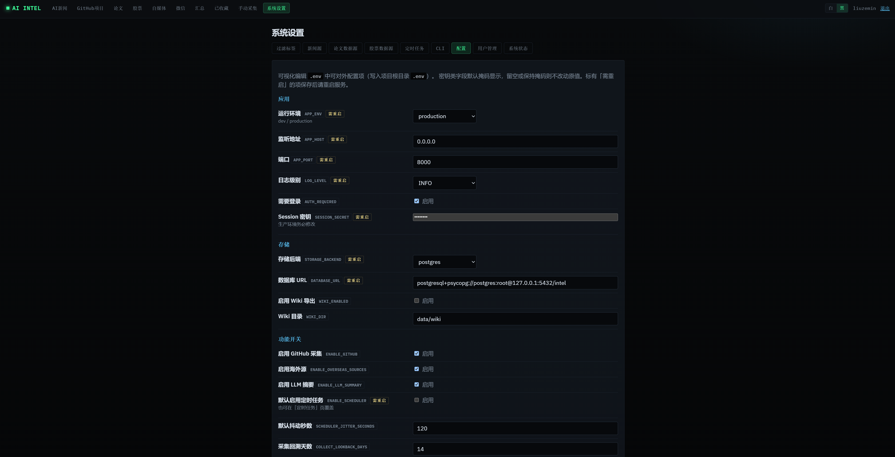 | 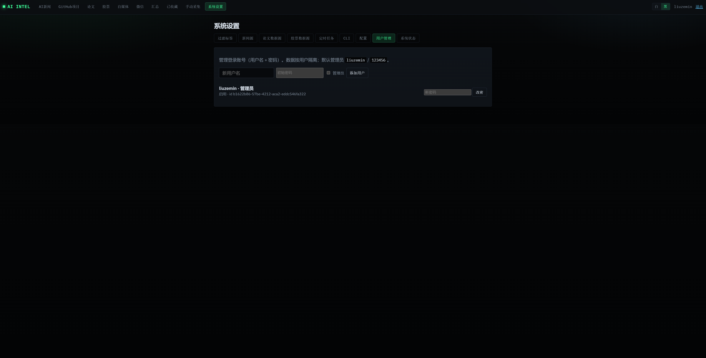 |

| 系统状态 | 关联依赖 |
|:---:|:---:|
| 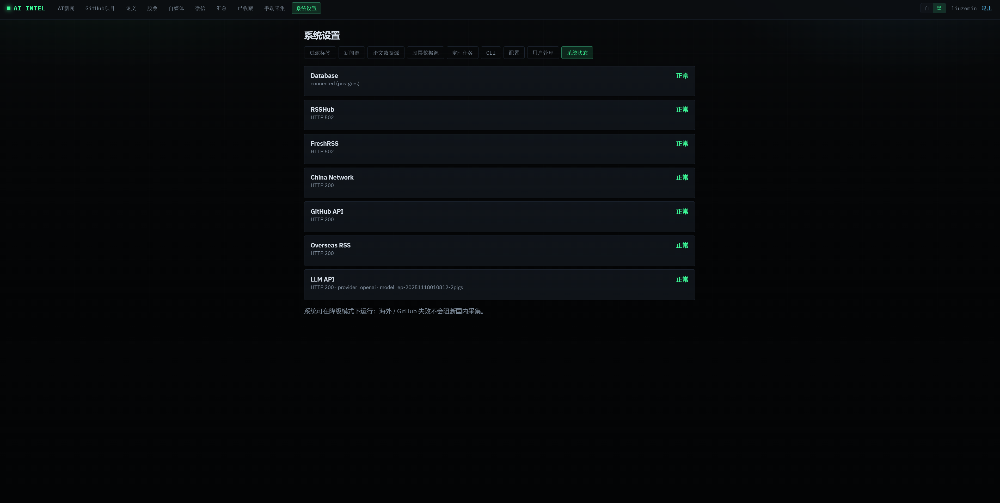 | 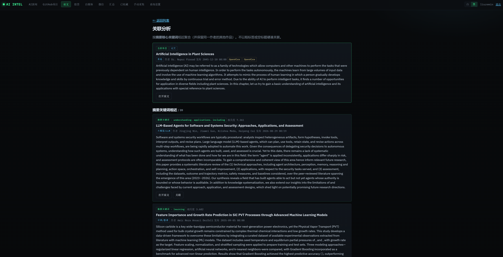 |

更多原图见仓库 [`static/`](./static/) 目录。

---

## 最快上手

```bash
git clone https://github.com/liuzemin/bagel.git
cd bagel
cp .env.example .env
uv sync
uv run bagel doctor
uv run bagel dev --host 127.0.0.1 --port 8000 --reload
```

默认使用 **SQLite**（`data/bagel.db`），无需 Docker / Postgres。

### MediaCrawler（自媒体）与仓库体积

- **源码不进 git**（`third_party/MediaCrawler/` 已 ignore），仓库保持精简。
- **默认启动时**：若开启自媒体且本地还没有 MediaCrawler，会自动 `git clone` 到本机（仅首次/缺失时）。
- **GitHub 在海外**：clone 可能需 **VPN / 代理**，或 `.env` 设置 `MEDIA_CRAWLER_GIT_URL` 镜像。失败不阻断主站。
- 若你曾 `git add .` 导致提交报 submodule 错，按文档修复索引即可。

详见 **[docs/git-and-mediacrawler.md](./docs/git-and-mediacrawler.md)**。

手动安装（可选）：

```bash
uv run bagel setup-media
```

### 启动命令命名

| 命令 | 作用 |
|------|------|
| `bagel` | 主 CLI 入口（包名 / 控制台脚本同名） |
| `bagel version` | 打印版本 |
| `bagel doctor` | 环境与依赖健康检查 |
| `bagel dev` | **开发启动** Web（默认 reload；可自动拉取 MediaCrawler） |
| `bagel setup-media` | 手动克隆 MediaCrawler 到 `third_party/`（gitignore） |
| `bagel cli …` | 外部工具（飞书 send / digest / ask） |

生产或无 reload：

```bash
uv run bagel dev --host 0.0.0.0 --port 8000 --no-reload
# 或等价：
uv run uvicorn bagel.main:app --host 0.0.0.0 --port 8000
```

可选：

- `STORAGE_BACKEND=postgres` + `DATABASE_URL=postgresql+psycopg://...`
- `WIKI_ENABLED=true` → 额外导出 Markdown 到 `data/wiki/`（给 Obsidian / RAG，**不能替代数据库**）

---

## 能力全景（归档）

本表整理当前仓库已落地能力，便于开源读者与二次开发者快速摸底。

### 采集与入库

| 能力 | 说明 |
|------|------|
| RSS / RSSHub 新闻 | 国内优先；海外源可在代理下采集，失败不阻断国内 |
| GitHub 项目 / Release | Token 可选；网络降级友好 |
| 论文源 | arXiv 等可配置源 |
| 股票资讯 | 独立源管理 + enrichment / 时间线 / 行研草稿（非荐股） |
| 自媒体 | 对接 MediaCrawler（**本机克隆**，不进仓库；`bagel setup-media`） |
| 微信 | Gewe 回调入库，关键词过滤 |
| Reddit RSS | 预置源 + 浏览器态请求头 |
| 去重 / 归一 | 统一 `IntelItem`；原始证据不被 LLM 覆盖 |
| 回溯窗口 | `COLLECT_LOOKBACK_DAYS` 控制新鲜度 |

### 审阅与产品页

| 路径 | 能力 |
|------|------|
| `/news` `/github` `/papers` `/stocks` `/media` `/wechat` | 列表、分类、收藏、关联条目 |
| `/briefs/*` | 周 / 月度总结模板，可导出 Markdown |
| `/favorites` | 收藏夹 |
| `/collect` | 手动触发采集任务 + 进度 |
| `/stocks/timeline` · 个股页 | 行情可视化（Yahoo OHLC，可关） |
| 明暗主题 | 本地持久化主题切换 |

### 系统设置

| 页签 | 能力 |
|------|------|
| 过滤标签 | INCLUDE / EXCLUDE 关键词规则 |
| 新闻 / 论文 / 股票源 | CRUD、启停 |
| 定时任务 | 间隔 30～720 分钟 + 抖动；新闻 / GitHub / 股票可勾选 |
| CLI · 飞书 | Webhook / lark-cli；昨日列表 / 周汇总推送；定时后异步推送 |
| 配置 | 可视化编辑 `.env`（路径对外相对化，不泄露本机绝对路径） |
| 用户管理 | 多用户登录、管理员、改密 |
| 系统状态 | DB / RSSHub / GitHub / LLM / 网络健康检查 |

### 飞书双场景

| 场景 | 行为 |
|------|------|
| **指令查询** | 飞书发「把 8/20–8/21 体操新闻发我」→ 查库 → 空则补采最新 → 回复；事件入口 `POST /api/feishu/events`，调试 `POST /api/feishu/command` |
| **定时推送** | 定时采集入库后异步推摘要（设置里勾选「定时采集完成后异步推送飞书」） |

CLI：

```bash
uv run bagel cli feishu-send "你好"
uv run bagel cli feishu-digest yesterday
uv run bagel cli feishu-ask "把8月20号到8月21号的体操方向新闻发我" --push
```

### 工程与运维

| 项 | 说明 |
|----|------|
| CLI | `bagel doctor` / `bagel dev` / `bagel cli …` |
| 存储 | SQLite 默认；Postgres 可选；Wiki Markdown 导出可选 |
| 调度 | 进程内 APScheduler（建议单 worker） |
| 鉴权 | Session；可 `AUTH_REQUIRED=false` 本地调试 |
| 测试 | `uv run pytest` |
| 代理 | `NETWORK_MODE=AUTO` + `HTTPS_PROXY=…` |

---

## 功能入口速查

| 路径 | 说明 |
|------|------|
| `/` | 首页 |
| `/news` | AI 新闻 |
| `/github` | GitHub 项目 |
| `/papers` | 论文 |
| `/stocks` | 股票资讯 |
| `/media` | 自媒体 |
| `/wechat` | 微信 |
| `/briefs/news` 等 | 汇总 |
| `/favorites` | 收藏 |
| `/collect` | 手动采集 |
| `/settings` | 系统设置 |
| `/health` | 存活探针 |
| `/api/feishu/events` | 飞书事件（公网回调） |
| `/api/feishu/command` | 飞书指令调试 API |

---

## 文档索引

| 文档 | 内容 |
|------|------|
| [AGENTS.md](./AGENTS.md) | 开发约束 |
| [docs/git-and-mediacrawler.md](./docs/git-and-mediacrawler.md) | `git add .` 修复 + 启动自动 clone + VPN |
| [docs/capabilities.md](./docs/capabilities.md) | 能力归档清单 |
| [docs/architecture.md](./docs/architecture.md) | 架构原则 |
| [docs/tech-stack.md](./docs/tech-stack.md) | 技术栈 |
| [docs/storage.md](./docs/storage.md) | SQLite / Postgres / Wiki |
| [docs/data-model.md](./docs/data-model.md) | 数据模型 |
| [docs/network.md](./docs/network.md) | 网络与代理 |
| [docs/default-news-sources.md](./docs/default-news-sources.md) | 默认新闻源 |
| [docs/user-config-media-wechat.md](./docs/user-config-media-wechat.md) | 自媒体 + 微信 |

---

## 代理（国内网络）

```env
NETWORK_MODE=AUTO
HTTPS_PROXY=http://127.0.0.1:7890
HTTP_PROXY=http://127.0.0.1:7890
```

海外源 / GitHub 不可达时：国内新闻继续；`bagel doctor` 与设置页显示降级告警。

---

## Docker（可选）

```bash
# 将 STORAGE_BACKEND=postgres 并指向 compose 服务后：
docker compose up -d
```

---

## 开源说明

- **协议**：MIT（见 [LICENSE](./LICENSE)）
- **品牌**：英文名 **Bagel**，中文名 **贝果**；Python 包 / CLI / 默认库文件均为 `bagel`
- **第三方**：`third_party/MediaCrawler` 为外部工具集成，遵循其自身许可证；请勿当作本仓库核心代码一并再许可
- **免责**：股票相关能力仅供信息整理，**不构成投资建议**

欢迎 Issue / PR。GitHub 仓库名建议使用 `bagel`。若本地目录仍叫 `ai-intel-center`，关闭占用后可自行改名为 `bagel`（包名与 CLI 已是 `bagel`，不影响运行）。

若从旧版升级：默认库文件由 `data/intel.db` 改为 `data/bagel.db`；可将旧库改名或在 `.env` 里继续指向原路径。

---

## 验收清单

- [ ] `uv run bagel dev` 后打开 http://127.0.0.1:8000
- [ ] 默认 SQLite 可采集国内新闻
- [ ] 系统设置可管理新闻源与过滤标签
- [ ] 主题切换与列表页正常
- [ ] `uv run pytest` 通过
